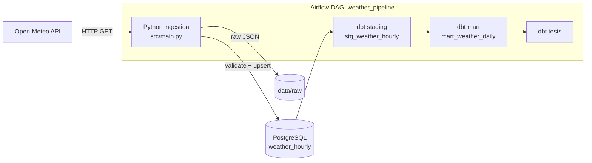
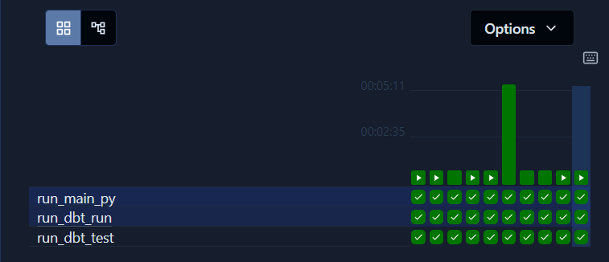
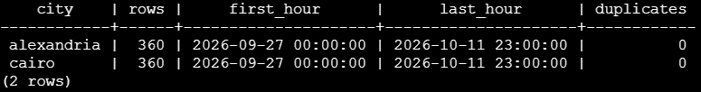
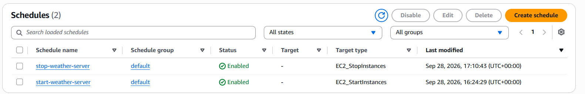

# 🌦️ Weather Forecast Data Platform

An automated daily ELT pipeline that ingests hourly weather forecasts for Egyptian cities from the Open-Meteo API, loads them idempotently into PostgreSQL, models them with dbt, and runs on **AWS EC2** orchestrated by **Apache Airflow** — with the server started and stopped on a schedule so it only runs when the pipeline does.


---

## 📌 Overview

| | |
|---|---|
| **Source** | [Open-Meteo Forecast API](https://open-meteo.com/) (free, no API key) |
| **Cities** | Cairo, Alexandria (configurable list) |
| **Data** | Hourly temperature, precipitation, humidity, wind speed, cloud cover — 14-day forecast |
| **Schedule** | Daily (`@daily`, 00:00 UTC) |
| **Volume per run** | 336 rows per city (14 days × 24 hours) |
| **Deployment** | AWS EC2 (Amazon Linux 2023, Frankfurt) with Docker Compose |

**Why I built this:** I wanted to take a pipeline beyond my laptop — deploy it to the cloud, run it unattended on a schedule, and deal with what actually breaks in production: missing environments, silent failures, idempotency, and cost.

---

## 🏗️ Architecture



**Airflow DAG:** `run_main_py` → `run_dbt_run` → `run_dbt_test`



*Recent runs on EC2 — daily scheduled runs and manual triggers, all three tasks succeeding. Earlier deployment failures are documented in [Challenges & Debugging](#-challenges--debugging).*

---

## 🧱 Data Model

| Layer | Object | Type | Grain |
|---|---|---|---|
| Raw | `weather_hourly` | Table | One row per **city per hour** — unique on `(city, time)`; `time` is **UTC**, exactly as returned by the API |
| Staging | `stg_weather_hourly` | View | One row per city per hour — `weather_time` converted to **Africa/Cairo** local time, original kept as `weather_time_utc` |
| Mart | `mart_weather_daily` | View | One row per **city per Cairo-local day** — daily avg/min/max per metric + `hours_count` |


---

## ⚙️ Key Engineering Decisions

| Decision | Why |
|---|---|
| **Upsert** (`ON CONFLICT DO UPDATE`) instead of insert-ignore | Forecasts are revised daily; the latest forecast is the most accurate, so existing rows are refreshed rather than kept stale |
| **Unique constraint on `(city, time)`** | Defines the table grain and makes the load idempotent — re-running the pipeline never creates duplicates |
| **`CREATE TABLE IF NOT EXISTS` + `mkdir(exist_ok=True)` in code** | The pipeline bootstraps its own schema and folders, so it runs on a fresh environment with no manual setup |
| **`sqlalchemy.URL.create()`** instead of an f-string connection URL | Safely escapes special characters in credentials (e.g. `@` in passwords) |
| **Pinned `dbt-core` / `dbt-postgres` versions** in the Airflow image | Reproducible builds — the same versions locally and on the server |
| **Separate Postgres instances** for Airflow metadata and business data | Isolates orchestration state from analytical data |
| **Secrets in `.env` / `profiles.yml`, excluded from Git** | Credentials never reach the repository |
| **Raw JSON persisted before loading** | Allows reprocessing and debugging without re-calling the API |
| **Validate before load** — unit mismatches raise after saving raw JSON, before touching the DB | Bad data never reaches the warehouse; the raw file is kept as evidence for debugging |
| **Fail loudly** — API errors raise instead of being logged and skipped | A failed city must turn the Airflow task red; a printed message with exit code 0 is a silent failure |
| **Request timeout + Airflow retries** (`timeout=30`, `retries=2`, 5-min delay) | Transient API errors (e.g. HTTP 503) recover automatically; retries are safe because the load is idempotent |
| **Everything scheduled in UTC** (DAG + server start/stop) | Avoids daylight-saving shifts breaking the timing between the server waking up and the DAG running |
| **Scheduled EC2 start/stop** (EventBridge Scheduler) | A once-a-day batch job doesn't need a 24/7 server |
| **Least-privilege IAM role** for the scheduler | The role can only start/stop this one instance — nothing else |
| **Raw timestamps kept in UTC, converted to `Africa/Cairo` in staging** (`AT TIME ZONE 'UTC' AT TIME ZONE 'Africa/Cairo'`) | Raw data stays exactly as the API returned it; the local-time conversion happens once, in dbt, and handles daylight-saving changes automatically (a fixed `+3 hours` would break every winter). `weather_time_utc` is kept for traceability |
| **`hours_count` in the daily mart** instead of filtering out incomplete days | The first/last day of the data can be partial (e.g. 3 hours after the UTC → Cairo shift), and daylight-saving days have 23 or 25 hours — so `HAVING COUNT(*) = 24` would silently drop real days. The mart exposes completeness instead of hiding data |
| **Per-city failure isolation** — each city is loaded independently; failures are collected and raised once at the end | One failing city no longer blocks the others: successful cities are still saved, and the task still turns red so the failure is noticed. Database errors stay outside the loop and fail immediately |

---

## ✅ Data Quality

- **Unit validation** at ingestion — every API response is checked against expected units (°C, mm, %, km/h); any mismatch fails the run before loading
- **dbt schema tests** on staging and mart models
- **Custom singular test** `assert_mart_unique_city_day` — guarantees the mart grain (one row per city per day)
- **Row-count and duplicate check** on the server: equal rows per city, same latest timestamp, zero duplicates
- **Completeness check** — `hours_count` per city per day in the mart; days with fewer than 23 hours are partial and should not be compared with full days



---

## ☁️ Deployment (AWS)

- **Compute:** EC2 `m7i-flex.large` (2 vCPU, 8 GB RAM) — upgraded from `t3.micro` after the Airflow stack ran out of memory on 1 GB
- **Runtime:** Docker Compose (Airflow 3 API server, scheduler, DAG processor, triggerer + 2 Postgres containers)
- **Code delivery:** GitHub is the source of truth → `git pull` on the server; the project folder is volume-mounted into the Airflow containers, so code changes need no image rebuild
- **Network security:** Airflow UI (port 8080) restricted to a single IP via Security Group; Postgres ports are not exposed publicly; default Airflow credentials changed
- **Cost control:** EventBridge Scheduler starts the instance at 23:45 UTC and stops it at 00:30 UTC — the DAG runs at 00:00 UTC in between. This cuts EC2 compute hours by ~97% (45 min/day instead of 24 h). An AWS Budget alert tracks spend.

```
23:45 UTC  EventBridge → StartInstances   (containers auto-restart)
00:00 UTC  Airflow DAG runs               (ingest → dbt run → dbt test)
00:30 UTC  EventBridge → StopInstances
```



---

## 🐞 Challenges & Debugging

Real issues hit while deploying to the cloud, and how they were fixed:

| # | Symptom | Root cause | Fix |
|---|---|---|---|
| 1 | Server unresponsive, containers restarting | Airflow stack needs ≥4 GB RAM; `t3.micro` has 1 GB | Resized instance to `m7i-flex.large` |
| 2 | `FileNotFoundError: data/raw/...` | `data/` is git-ignored, so the folder didn't exist on the server | Code creates the folder with `mkdir(parents=True, exist_ok=True)` |
| 3 | Server ran old logic | Local changes were never pushed; the server pulls from GitHub | Commit + push workflow; GitHub as single source of truth |
| 4 | `could not translate host name "123@weather-postgres"` | `@` in the password broke the f-string connection URL | Switched to `URL.create()` |
| 5 | `NoSuchTableError: weather_hourly` | Table was created manually on the laptop, not on the fresh server DB | `CREATE TABLE IF NOT EXISTS` in the pipeline (schema as code) |
| 6 | dbt failed parsing `profiles.yml` | YAML requires a space after `:` in `key: value` | Fixed the YAML syntax |
| 7 | Daily mart mixed both cities into one average | `GROUP BY day` only — mart wasn't updated when `city` was added | Grain changed to `city + day`; uniqueness test updated to match |
| 8 | **First scheduled run was green, but Alexandria got no new data** | API returned HTTP 503; the code printed the error and `return`ed, so the script exited 0 — a **silent failure** | Raise on API errors, add request timeout and Airflow retries; caught by checking `MAX(time)` per city |
| 9 | **Daily metrics were shifted by 3 hours** — no error, tests passing | No `timezone` parameter is sent, so Open-Meteo returns **UTC**; the mart grouped by UTC days (a "day" started at 3 AM Cairo time) | Kept raw in UTC, converted to `Africa/Cairo` in staging with `AT TIME ZONE`; caught by noticing the raw data started at `00:00` and ended at `23:00` UTC |
| 10 | After the timezone fix, a new last day appeared with a max temp **8 °C lower** than the day before | The last 3 UTC hours crossed midnight in Cairo time → a **partial day** with only night hours | Added `hours_count` to the mart; found with `HAVING COUNT(*) <> 24` (first day had 21 hours, last day 3) |
| 11 | `relation "mart_weather_daily" does not exist` after editing staging | A column (`temperature_2m`) was lost while editing the staging model; dbt rebuilt the staging view (`DROP ... CASCADE` removed the mart) and the new mart failed | Traced backwards with `information_schema.columns`; restored the column. Lesson: the error appeared two steps after the real cause |
| 12 | Airflow UI on EC2 timed out, even though all containers were healthy | Using a **stale public IP** — it changes on every instance start | Narrowed it down layer by layer (`docker ps` → `curl localhost` on the server → Security Group source IP → port 22 test) until only the address was left; always read the current IP from the EC2 console |

**Main lessons:**
- Anything done manually in one environment breaks in the next — the pipeline should create everything it needs.
- A green task doesn't mean correct data — failures must be loud, and outputs must be checked.
- Always ask "in which timezone?" and "how many rows should there be?" — both silent bugs above were found by comparing the expected count with the actual one.

---

## 🚀 Run Locally

**Prerequisites:** Docker Desktop, Git

```bash
git clone https://github.com/peteratef-eng/weather-forecast-data-platform.git
cd weather-forecast-data-platform
```

1. Create a `.env` file in the project root:

```dotenv
DB_USER=postgres
DB_PASSWORD=your_password
DB_HOST=weather-postgres
DB_PORT=5432
DB_NAME=weather_db
```

2. Create `~/.dbt/profiles.yml` for the `weather_dbt` project (host, user, password, dbname matching the `.env` above).

3. Start the stack:

```bash
cd airflow
docker compose up -d --build
```

4. Open the Airflow UI at `http://localhost:8080`, unpause `weather_pipeline`, and trigger a run.

---

## 📁 Project Structure

```
.
├── airflow/
│   ├── dags/weather_pipeline_dag.py   # Airflow DAG
│   ├── Dockerfile                     # Airflow image + pinned dbt
│   └── docker-compose.yaml
├── docs/
│   └── images/                        # README screenshots
├── src/
│   └── main.py                        # Ingestion: API → raw JSON → validate → Postgres (upsert)
├── weather_dbt/
│   ├── models/
│   │   ├── stg_weather_hourly.sql
│   │   ├── mart_weather_daily.sql
│   │   └── schema.yml
│   └── tests/
│       └── assert_mart_unique_city_day.sql
├── Dockerfile
└── requirements.txt
```

---

## 🔭 Future Improvements

**Known limitations**
- Raw JSON is stored on the EC2 disk rather than object storage
- The server's public IP changes on every start (no Elastic IP, to avoid its hourly cost)

**Planned**
- **Air quality ingestion** (Open-Meteo Air Quality API) joined with weather in dbt
- `dim_city` dimension + more cities from a config file (star schema)
- **pytest** for ingestion logic + **CI with GitHub Actions** (tests + `dbt build` on every push)
- dbt freshness test: every city must share the same latest timestamp
- dbt `profiles.yml` reading credentials from environment variables (`env_var`)
- `.env.example` template
- Raw data to **S3**
- Automated deploy to EC2 on merge (replacing manual `git pull`)
- Failure alerting (email/Slack callbacks)
- Streamlit dashboard for the daily mart

---

## 👤 Author

**Peter Atef** — Junior Data Engineer
[GitHub](https://github.com/peteratef-eng) · [LinkedIn](https://www.linkedin.com/in/peter-atef-eng) · [Portfolio](https://peter-atef-eng.streamlit.app)
